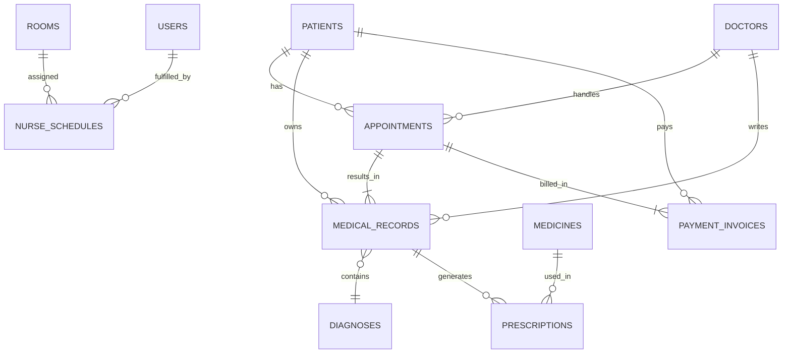
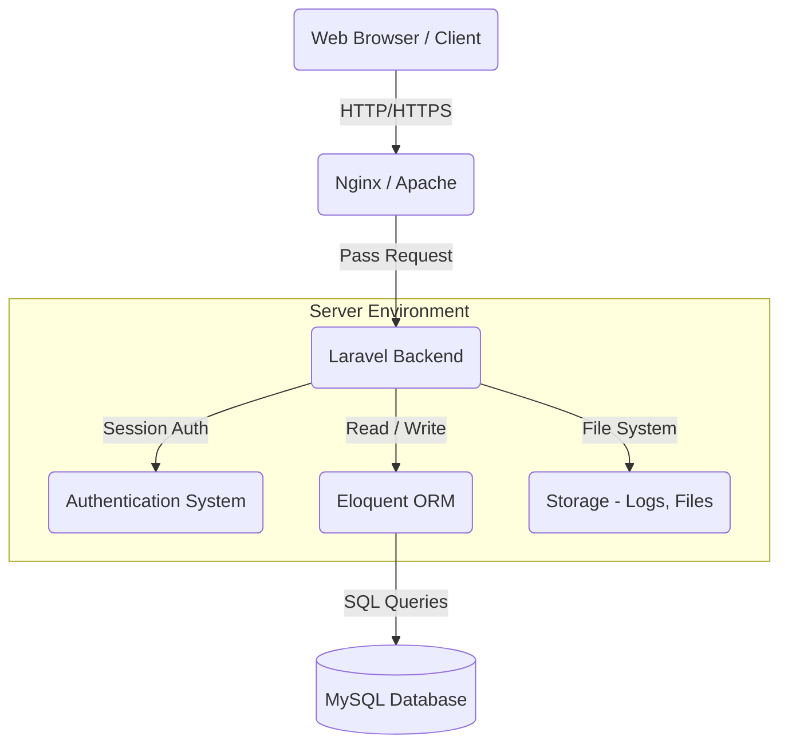

# Product Requirements Document (PRD)
**Project Name:** SIMKLIN (Sistem Manajemen Klinik)
**Version:** 1.0.0
**Date:** 17 Juli 2026

---

## 1. Product Overview

### Nama Produk
SIMKLIN (Sistem Manajemen Klinik)

### Deskripsi Singkat
SIMKLIN adalah aplikasi berbasis web yang dirancang khusus untuk membantu operasional klinik dalam mengelola data pasien, jadwal dokter, rekam medis, resep obat, pembayaran, dan berbagai aktivitas administratif lainnya secara terpusat, digital, dan terintegrasi.

### Latar Belakang
Banyak klinik kesehatan masih mengandalkan pencatatan manual berbasis kertas atau menggunakan perangkat lunak yang tidak terintegrasi. Hal ini menyebabkan lambatnya pelayanan, risiko kehilangan atau kerusakan rekam medis pasien, serta kesulitan manajemen dalam memantau laporan keuangan dan kinerja operasional klinik.

### Tujuan Produk
Mengubah operasional klinik dari sistem manual ke sistem digital yang terintegrasi penuh, memberikan pengalaman yang lebih baik bagi pasien dan efisiensi kerja yang maksimal bagi tenaga medis dan staf administrasi.

### Value Proposition
"SIMKLIN menyederhanakan kompleksitas manajemen klinik Anda, sehingga Anda dapat lebih fokus memberikan pelayanan kesehatan terbaik kepada pasien."

---

## 2. Problem Statement

Klinik saat ini menghadapi berbagai permasalahan operasional, antara lain:
- **Kesulitan mengelola data pasien:** Data pasien tersebar dalam dokumen fisik, rentan hilang, dan pencarian riwayat medis membutuhkan waktu lama.
- **Penjadwalan dokter masih manual:** Pasien harus menelepon atau datang langsung untuk membuat janji, rentan terjadi bentrok jadwal atau antrean panjang.
- **Rekam medis belum terintegrasi:** Dokter kesulitan melihat riwayat kesehatan pasien secara komprehensif, membatasi ketepatan diagnosis dan tindakan pengobatan selanjutnya.
- **Resep obat masih dicatat secara manual:** Tulisan tangan resep berisiko menimbulkan kesalahan pemberian obat (medication error) oleh apotek.
- **Pembayaran belum terkelola dengan baik:** Proses billing atau pembuatan invoice masih lambat, menyulitkan dalam pelaporan keuangan bulanan klinik.
- **Sulit memantau statistik kunjungan pasien:** Manajemen klinik kesulitan mengetahui tren kunjungan, yang penting untuk evaluasi dan pengembangan layanan.

---

## 3. Goals & Objectives

- **Digitalisasi operasional klinik:** Mengurangi penggunaan kertas (paperless) di semua lini operasional.
- **Mempermudah pelayanan pasien:** Registrasi dan antrean janji temu menjadi lebih cepat dan teratur.
- **Mempercepat proses administrasi:** Mengurangi beban administrasi staf dengan otomatisasi penagihan dan pencatatan.
- **Menyediakan data yang akurat:** Sentralisasi data memastikan informasi yang diakses selalu up-to-date dan akurat.
- **Meningkatkan efisiensi kerja tenaga medis:** Dokter dan perawat memiliki sistem yang membantu fokus pada perawatan medis alih-alih dokumen.

---

## 4. Target Users

- **Admin Klinik:** Bertanggung jawab atas pengelolaan data sistem, tagihan, dan operasional pendaftaran harian.
- **Dokter:** Memberikan layanan konsultasi, membuat diagnosis, menulis resep obat elektronik, dan mencatat rekam medis.
- **Perawat:** Menangani pemeriksaan awal pasien (tanda-tanda vital), membantu dokter, dan memantau ketersediaan kamar.
- **Pasien:** (Melalui antarmuka pasien jika disediakan di masa depan, atau saat berinteraksi dengan staf) Pengguna akhir layanan klinik.

---

## 5. User Persona

**1. Rina (Admin Klinik - 28 Tahun)**
*Rina mengurus pendaftaran pasien setiap pagi. Ia sering kewalahan jika banyak pasien mendaftar di waktu yang sama. Ia butuh sistem yang cepat mencari data pasien dan mencetak tagihan dengan satu klik.*

**2. dr. Budi (Dokter Umum - 45 Tahun)**
*Dokter Budi melayani hingga 40 pasien sehari. Ia benci menulis resep manual dan sering lupa riwayat alergi pasien. Ia butuh rekam medis digital yang mudah dibaca dan cepat diketik.*

---

## 6. User Stories

- *Sebagai Admin*, saya ingin mendaftarkan pasien baru, sehingga pasien tersebut memiliki rekam identitas di sistem.
- *Sebagai Admin*, saya ingin membuat jadwal appointment untuk pasien, agar tidak terjadi penumpukan antrean di ruang tunggu.
- *Sebagai Dokter*, saya ingin melihat rekam medis historis pasien, agar saya dapat memberikan diagnosis yang akurat.
- *Sebagai Dokter*, saya ingin menginput resep obat ke sistem, agar bagian farmasi/kasir dapat langsung memprosesnya tanpa kertas.
- *Sebagai Perawat*, saya ingin mengatur penempatan pasien ke ruang pemeriksaan, agar alur konsultasi berjalan lancar.
- *Sebagai Admin*, saya ingin membuat invoice tagihan secara otomatis, agar pasien dapat langsung membayar biaya konsultasi dan obat.

---

## 7. Functional Requirements

### 1. Registrasi dan Manajemen Data Pasien
- **Tujuan:** Menyimpan data demografis dan identitas pasien.
- **Aktor:** Admin.
- **Alur Proses:** Admin masuk ke menu Pasien -> Klik Tambah -> Isi Form -> Simpan.
- **Input:** Nama, NIK, Tanggal Lahir, Jenis Kelamin, Alamat, No. HP, Golongan Darah.
- **Output:** Profil pasien dengan nomor rekam medis (RM) unik yang di-generate otomatis.
- **Validasi:** NIK harus unik (16 digit), No HP angka.
- **Kondisi Berhasil:** Data tersimpan dan nomor RM muncul.
- **Kondisi Gagal:** Muncul pesan error jika NIK sudah terdaftar atau input tidak valid.

### 2. Penjadwalan Appointment Dokter
- **Tujuan:** Mengelola janji temu pasien dengan dokter.
- **Aktor:** Admin.
- **Alur Proses:** Pilih Pasien -> Pilih Dokter -> Pilih Tanggal & Jam -> Simpan Appointment.
- **Input:** ID Pasien, ID Dokter, Tanggal, Jam, Keluhan Awal.
- **Output:** Tiket antrean/jadwal appointment dengan status "Scheduled".
- **Validasi:** Dokter tidak boleh memiliki dua appointment di jam yang sama.
- **Kondisi Berhasil:** Appointment masuk ke jadwal dokter.
- **Kondisi Gagal:** Error jadwal bentrok.

### 3. Rekam Medis Digital Per Pasien
- **Tujuan:** Mencatat riwayat konsultasi pasien.
- **Aktor:** Dokter, Perawat (Pemeriksaan awal).
- **Alur Proses:** Pilih Appointment aktif -> Isi Tanda Vital (Perawat) -> Isi Diagnosis & Tindakan (Dokter) -> Simpan.
- **Input:** Tinggi, Berat, Tekanan Darah (Perawat); Catatan SOAP, Diagnosis ID (Dokter).
- **Output:** Dokumen rekam medis terhubung dengan profil pasien.
- **Validasi:** Field SOAP (Subjective, Objective, Assessment, Plan) tidak boleh kosong.
- **Kondisi Berhasil:** Rekam medis terkunci dan tersimpan.
- **Kondisi Gagal:** Error validasi form.

### 4. Resep Obat Elektronik (E-Prescription)
- **Tujuan:** Mengeluarkan resep obat secara digital.
- **Aktor:** Dokter.
- **Alur Proses:** Buka Rekam Medis -> Klik Tambah Resep -> Pilih Obat, Dosis, Aturan Pakai -> Simpan.
- **Input:** ID Obat, Jumlah, Instruksi pemakaian.
- **Output:** Daftar resep obat terkait dengan rekam medis.
- **Validasi:** Stok obat mencukupi (Opsional), ID Obat valid.
- **Kondisi Berhasil:** Resep terbentuk, dikirim ke modul tagihan/farmasi.
- **Kondisi Gagal:** Gagal simpan jika stok tidak cukup.

### 5. Manajemen Kamar dan Jadwal Perawat
- **Tujuan:** Mengatur penggunaan ruang periksa/rawat dan jadwal dinas perawat.
- **Aktor:** Admin.
- **Alur Proses:** Menu Kamar/Jadwal -> Assign Perawat ke Shift dan Kamar.
- **Input:** ID Perawat, ID Kamar, Shift Pagi/Sore/Malam, Tanggal.
- **Output:** Tabel jadwal dinas dan pemakaian kamar.
- **Validasi:** Satu kamar maksimal digunakan 1 dokter/perawat pada 1 shift.
- **Kondisi Berhasil:** Jadwal ter-update.
- **Kondisi Gagal:** Bentrok penjadwalan kamar.

### 6. Invoice dan Pembayaran Layanan Klinik
- **Tujuan:** Melakukan penagihan (billing) kepada pasien setelah selesai konsultasi.
- **Aktor:** Admin / Kasir.
- **Alur Proses:** Buka data Appointment selesai -> Generate Invoice -> Terima Pembayaran -> Cetak Struk.
- **Input:** Biaya Jasa Dokter, Biaya Obat, Jumlah Uang Dibayar.
- **Output:** Struk pembayaran berstatus "Lunas".
- **Validasi:** Total bayar >= Total Tagihan.
- **Kondisi Berhasil:** Status pembayaran berubah menjadi "Paid".
- **Kondisi Gagal:** Input pembayaran kurang.

### 7. Dashboard Statistik Kunjungan Pasien
- **Tujuan:** Memberikan ringkasan informasi harian dan bulanan klinik.
- **Aktor:** Admin, Dokter (Terbatas).
- **Alur Proses:** Akses halaman utama (Home).
- **Input:** Rentang tanggal (Filter).
- **Output:** Grafik jumlah pasien, total pendapatan, pasien per dokter.
- **Validasi:** Filter tanggal harus valid.
- **Kondisi Berhasil:** Grafik dan angka ter-render dengan benar.
- **Kondisi Gagal:** Menampilkan data kosong.

---

## 8. Non Functional Requirements

- **Performance:** Aplikasi harus merespons dalam waktu < 2 detik pada kondisi normal.
- **Security:** Data pasien dilindungi secara ketat sesuai regulasi privasi. Enkripsi password menggunakan Bcrypt.
- **Availability:** Uptime target 99.9% selama jam operasional klinik.
- **Scalability:** Mampu menangani hingga 1.000 kunjungan per hari tanpa degradasi performa.
- **Maintainability:** Codebase menggunakan framework Laravel yang clean dan sesuai standar MVC.
- **Reliability:** Proses auto-backup database setiap hari pada pukul 00:00.
- **Compatibility:** Berjalan optimal di Chrome, Firefox, Safari (Desktop & Mobile Browser).
- **Usability:** Antarmuka responsif dan intuitif, meminimalkan jumlah klik untuk menyelesaikan satu task.

---

## 9. Role & Permission

- **Admin / Kasir:**
  - Mengelola data Pasien, Dokter, Perawat, Kamar, Jadwal.
  - Membuat dan mengelola Appointment.
  - Memproses Pembayaran / Invoice.
  - Melihat Dashboard finansial dan operasional.
- **Dokter:**
  - Melihat jadwal Appointment miliknya.
  - Mengisi dan melihat Rekam Medis (Medical Records).
  - Menulis resep elektronik (Prescriptions).
  - Melihat Dashboard kunjungan pasien harian.
- **Perawat:**
  - Melihat jadwal dinas dan penggunaan Kamar.
  - Memasukkan data triase/tanda-tanda vital (suhu, tensi) ke Rekam Medis sebelum dokter memeriksa.
- **Pasien:**
  - (Fase awal: Tidak memiliki hak akses login. Data sepenuhnya dikelola oleh Admin).

---

## 10. User Flow

1. **Login:** User memasukkan email dan password -> Sistem memvalidasi -> Masuk ke Dashboard sesuai Role.
2. **Kunjungan Pasien Baru:** Admin mendaftarkan Pasien -> Sistem generate No. RM -> Admin membuat Appointment -> Pasien menunggu panggilan.
3. **Pemeriksaan Awal:** Perawat memanggil Pasien ke Kamar Triage -> Input data vital di Rekam Medis -> Status antrean update.
4. **Konsultasi Dokter:** Dokter melihat pasien di sistem -> Melakukan pemeriksaan fisik/anamnesis -> Mengisi Diagnosis di Rekam Medis -> Memberikan e-Prescription -> Simpan.
5. **Pembayaran:** Pasien ke meja Admin/Kasir -> Admin membuka Invoice otomatis (gabungan biaya layanan dan obat) -> Pasien bayar -> Status selesai.

---

## 11. Wireframe Sederhana (ASCII)

### Login Page
```text
+---------------------------------------------------+
|                  SIMKLIN SYSTEM                   |
|                                                   |
|   Email    [__________________________]           |
|   Password [__________________________]           |
|                                                   |
|                [   LOGIN   ]                      |
+---------------------------------------------------+
```

### Dashboard (Admin)
```text
+---------------------------------------------------+
| SIMKLIN    | Dashboard Overview                   |
| - Home     |                                      |
| - Pasien   | [ Pasien Hari Ini: 45 ]  [ Pendapatan ]
| - Dokter   | [ Appointment Aktif: 12] [ Rp 5.000.k]|
| - Apotek   |                                      |
| - Tagihan  | Grafik Kunjungan Mingguan:           |
|            |  |  *  *                             |
|            |  | * *  *  *                         |
|            |  +----------------------             |
+---------------------------------------------------+
```

### Rekam Medis (Dokter View)
```text
+---------------------------------------------------+
| RM Pasien: Budi Santoso (RM-00192)                |
|                                                   |
| Tanda Vital (Oleh Perawat): Tensi: 120/80         |
| ------------------------------------------------- |
| Subjective : [__________________________________] |
| Objective  : [__________________________________] |
| Assessment : [ Pilih Diagnosis (ICD-10) v ]       |
| Plan       : [__________________________________] |
|                                                   |
| [ Tambah Resep Obat ]       [ SIMPAN REKAM MEDIS] |
+---------------------------------------------------+
```

---

## 12. Navigation Structure

- **Dashboard** (Semua Role)
- **Manajemen Pengguna** (Admin)
  - Data Dokter
  - Data Perawat
- **Pasien & Antrean** (Admin, Perawat)
  - Registrasi Pasien
  - Jadwal Appointment
- **Pemeriksaan Medis** (Dokter)
  - Rekam Medis
  - Diagnosa
- **Farmasi** (Admin, Dokter)
  - Data Obat (Medicines)
  - E-Prescription
- **Kasir** (Admin)
  - Invoice & Pembayaran
- **Manajemen Operasional** (Admin)
  - Manajemen Kamar
  - Jadwal Perawat
- **Laporan** (Admin)

---

## 13. Database Design

Berikut adalah struktur tabel yang digunakan di MySQL:

| No | Nama Tabel | Tujuan | Primary Key | Foreign Key |
|---|---|---|---|---|
| 1 | **patients** | Menyimpan profil pasien | `id` | - |
| 2 | **doctors** | Menyimpan data dokter | `id` | `user_id` |
| 3 | **appointments** | Mengelola janji temu | `id` | `patient_id`, `doctor_id` |
| 4 | **medical_records**| Menyimpan catatan pemeriksaan | `id` | `appointment_id`, `patient_id`, `doctor_id` |
| 5 | **prescriptions** | Menyimpan resep terkait RM | `id` | `medical_record_id`, `medicine_id` |
| 6 | **medicines** | Katalog obat-obatan | `id` | - |
| 7 | **diagnoses** | Kamus penyakit (ICD/Umum) | `id` | - |
| 8 | **payment_invoices**| Mencatat tagihan dan bayaran | `id` | `appointment_id`, `patient_id` |
| 9 | **rooms** | Ruang pemeriksaan/perawatan | `id` | - |
| 10| **nurse_schedules**| Penjadwalan perawat dan ruang | `id` | `nurse_id` (users), `room_id` |

**Detail per tabel:**

**1. patients**
- `id` (BIGINT, AI)
- `medical_record_number` (VARCHAR, Unique)
- `name` (VARCHAR)
- `nik` (VARCHAR, Unique)
- `date_of_birth` (DATE)
- `gender` (ENUM: M, F)
- `phone` (VARCHAR)
- `address` (TEXT)
- `blood_type` (VARCHAR)

**2. doctors**
- `id` (BIGINT, AI)
- `user_id` (BIGINT) -> FK users.id
- `specialization` (VARCHAR)
- `license_number` (VARCHAR)
- `phone` (VARCHAR)

**3. appointments**
- `id` (BIGINT, AI)
- `patient_id` (BIGINT) -> FK patients.id
- `doctor_id` (BIGINT) -> FK doctors.id
- `appointment_date` (DATETIME)
- `status` (ENUM: scheduled, completed, cancelled)
- `notes` (TEXT)

**4. medical_records**
- `id` (BIGINT, AI)
- `appointment_id` (BIGINT) -> FK appointments.id
- `patient_id` (BIGINT) -> FK patients.id
- `doctor_id` (BIGINT) -> FK doctors.id
- `diagnosis_id` (BIGINT) -> FK diagnoses.id
- `blood_pressure` (VARCHAR)
- `temperature` (DECIMAL)
- `symptoms` (TEXT) - Subjective
- `physical_exam` (TEXT) - Objective
- `treatment_plan` (TEXT) - Plan

**5. prescriptions**
- `id` (BIGINT, AI)
- `medical_record_id` (BIGINT) -> FK medical_records.id
- `medicine_id` (BIGINT) -> FK medicines.id
- `quantity` (INT)
- `dosage_instruction` (VARCHAR)

**6. medicines**
- `id` (BIGINT, AI)
- `name` (VARCHAR)
- `type` (VARCHAR) - Sirup, Tablet
- `price` (DECIMAL)
- `stock` (INT)

**7. diagnoses**
- `id` (BIGINT, AI)
- `code` (VARCHAR) - ICD-10
- `description` (VARCHAR)

**8. payment_invoices**
- `id` (BIGINT, AI)
- `appointment_id` (BIGINT) -> FK appointments.id
- `patient_id` (BIGINT) -> FK patients.id
- `consultation_fee` (DECIMAL)
- `medicine_fee` (DECIMAL)
- `total_amount` (DECIMAL)
- `status` (ENUM: unpaid, paid)
- `payment_method` (VARCHAR)
- `paid_at` (DATETIME, Nullable)

**9. rooms**
- `id` (BIGINT, AI)
- `name` (VARCHAR)
- `room_type` (VARCHAR)
- `status` (ENUM: available, occupied, maintenance)

**10. nurse_schedules**
- `id` (BIGINT, AI)
- `user_id` (BIGINT) -> FK users.id (Perawat)
- `room_id` (BIGINT) -> FK rooms.id
- `shift` (ENUM: morning, afternoon, night)
- `date` (DATE)

---

## 14. Data Schema & Architecture

### A. Penjelasan Naratif
Sistem SIMKLIN berpusat pada entitas `patients` (Pasien). Sebuah aktivitas layanan kesehatan dimulai saat dibuatnya `appointments` (Janji Temu) yang menghubungkan pasien dengan `doctors`. Setelah konsultasi dilakukan, sebuah `medical_records` (Rekam Medis) dihasilkan. Rekam medis ini merujuk ke tabel `diagnoses` untuk klasifikasi penyakit standar.
Dokter juga dapat menerbitkan `prescriptions` (Resep) yang merupakan relasi many-to-many antara rekam medis dan `medicines` (Katalog Obat). 
Setelah selesai, sistem billing akan mengambil rincian layanan dan obat untuk digabungkan menjadi `payment_invoices` (Tagihan) yang dibebankan kepada pasien.
Di sisi manajemen operasional, `rooms` (Kamar) dialokasikan untuk jadwal dinas harian perawat melalui tabel `nurse_schedules`.

### B. Visualisasi ERD



---

## 15. System Architecture

Sistem SIMKLIN mengadopsi pola Monolithic Architecture klasik menggunakan kerangka kerja Laravel dengan perenderan server-side menggunakan Blade Templates (atau integrasi Vue/React jika menggunakan Inertia).
- **Client:** Web browser modern (Chrome, Safari, Firefox).
- **Web Server:** Apache atau Nginx sebagai reverse proxy.
- **Backend Framework:** Laravel (PHP 8.x). Mengatur logika bisnis, keamanan, dan ORM (Eloquent).
- **Database:** MySQL untuk penyimpanan data relasional.
- **Authentication:** Laravel Sanctum / Laravel Breeze/Jetstream (Session-based untuk Web).
- **Storage:** Local disk Laravel untuk penyimpanan berkas (opsional jika ada upload dokumen).

### Arsitektur Sistem (Mermaid)



---

## 16. Laravel Project Structure

Sistem akan menggunakan standar direktori Laravel:
- `app/` : Berisi inti aplikasi (Models, Http/Controllers, Http/Middleware, Observers, Services). Logika bisnis utama SIMKLIN ada di sini.
- `bootstrap/` : Skrip bootstrapping kerangka kerja dan konfigurasi cache.
- `config/` : Seluruh konfigurasi sistem, database, mail, keamanan.
- `database/` : File migrasi database (`migrations/`), seeder (`seeders/`), dan factories. Untuk pembuatan tabel poin 13.
- `public/` : Entry point aplikasi (`index.php`), menyimpan aset publik seperti CSS, JS, Gambar.
- `resources/` : View templates (Blade files / Vue komponen), file terjemahan bahasa, dan raw assets.
- `routes/` : Deklarasi rute aplikasi (`web.php` untuk antarmuka browser, `api.php` jika dikembangkan ke mobile/API).
- `storage/` : Log error Laravel, cache template, file uploadaan (contoh: foto pasien).
- `tests/` : Folder untuk Automated Testing (Unit tests & Feature tests) guna memastikan fitur klinik berjalan baik.

---

## 17. REST API Design

Meskipun sistem utama berbasis web monolith, SIMKLIN mengekspos endpoint API (jika diperlukan untuk aplikasi mobile dokter/pasien di masa depan).

| Method | Endpoint | Description |
|---|---|---|
| POST | `/api/login` | Melakukan autentikasi dan mendapatkan token. |
| POST | `/api/logout` | Mengakhiri sesi (revoke token). |
| GET | `/api/patients` | Mengambil seluruh data pasien (dengan paginasi). |
| POST | `/api/patients` | Menambahkan data pasien baru. |
| GET | `/api/doctors` | Mengambil daftar dokter beserta jadwal spesialisasi. |
| POST | `/api/appointments` | Membuat jadwal janji temu baru. |
| GET | `/api/appointments` | Melihat daftar jadwal janji temu (Bisa filter by date/doctor). |
| PUT | `/api/appointments/{id}` | Mengubah status jadwal janji temu (e.g. Cancel). |
| POST | `/api/medical-records` | Dokter menyimpan rekam medis. |
| GET | `/api/medical-records/{patient_id}` | Melihat historis rekam medis pasien. |
| GET | `/api/medicines` | Menampilkan stok dan katalog obat. |
| POST | `/api/prescriptions` | Menyimpan resep yang diberikan dokter. |
| GET | `/api/payments` | Melihat daftar invoice. |
| PUT | `/api/payments/{id}` | Memproses/melunasi pembayaran tagihan. |
| GET | `/api/rooms` | Menampilkan status okupansi kamar klinik. |
| GET | `/api/dashboard/stats` | Mengambil data statistik chart dashboard harian. |

---

## 18. Validation Rules

Setiap modul diwajibkan melewati validasi input, antara lain:
- **Pasien:** NIK harus berjumlah 16 digit angka numerik (Unique), Tanggal Lahir tidak boleh di masa depan, Nama wajib diisi, Nomor telepon hanya angka maksimal 15 digit.
- **Appointment:** `doctor_id` dan `patient_id` harus terdaftar (exists di DB). Waktu tidak boleh di masa lalu (Backdate). Tidak boleh ada jadwal ganda pada jam dan dokter yang sama.
- **Medical Records:** `diagnosis_id` wajib disi, field subjektif dan objektif minimal 10 karakter untuk kelengkapan data.
- **Prescription:** `quantity` obat harus integer positif minimal 1.
- **Payment:** Total uang pembayaran harus berwujud numerik dan `total_bayar >= total_tagihan`.

---

## 19. Security Requirements

- **Authentication:** Hanya pengguna terdaftar yang memiliki peran jelas (Role) yang bisa login (Admin, Dokter, Perawat).
- **Authorization:** Dokter tidak bisa mengakses menu manajemen keuangan. Perawat tidak bisa meresepkan obat. Diterapkan via middleware Laravel dan Spatie Permission.
- **Password Hashing:** Semua kata sandi dan PIN akan di-hash menggunakan algoritma Bcrypt (bawaan Laravel).
- **CSRF Protection:** Setiap form pengajuan via POST/PUT/DELETE wajib melampirkan `@csrf` token untuk menghindari Cross-Site Request Forgery.
- **SQL Injection Prevention:** Wajib menggunakan Eloquent ORM atau query builder PDO yang menerapkan parameter binding otomatis.
- **XSS Protection:** Penggunaan Blade `{{ $variable }}` untuk rendering data dari database agar skrip HTML/JS otomatis di-escape.
- **Input Validation:** Backend wajib memvalidasi menggunakan Laravel Form Requests sebelum masuk ke Database.
- **Session Management:** Session kadaluarsa dalam waktu 120 menit jika inaktif untuk keamanan komputer di klinik.

---

## 20. Deployment Strategy

- **Environment Configuration:** File `.env` dipisahkan secara tegas untuk environment `local` dan `production`. Mode `APP_DEBUG` wajib `false` saat live.
- **Database:** Server MySQL produksi harus dipisahkan dari web server jika lalu lintas sangat tinggi, dengan backup otomatis ke cloud (AWS S3) menggunakan cron job.
- **Web Server:** Menggunakan VPS (contoh: DigitalOcean/AWS) dengan OS Ubuntu Server. Web server Nginx dikonfigurasi melayani aplikasi via PHP-FPM 8.x.
- **Proses Deploy:** Menggunakan Git. Flow deploy: `git pull origin main` -> `composer install --no-dev` -> `php artisan migrate --force` -> `php artisan config:cache` -> `php artisan route:cache` -> `npm run build`.

---

## 21. Risk Analysis

| Identifikasi Risiko Teknis | Dampak | Solusi Mitigasi |
|---|---|---|
| **Data Breach / Kebocoran Data Pasien** | Kehilangan reputasi, sanksi hukum (UU ITE/PDP). | Enkripsi data sensitif, audit trail akses user, batasi akses database hanya via lokal server/VPN. |
| **Server Down saat jam sibuk klinik** | Operasional klinik terhenti (pasien antre lama).| Sediakan Load Balancer jika traffic tinggi, monitoring Uptime (misal pakai NewRelic/Sentry), dan plan VPS spesifikasi mumpuni. |
| **Data hilang karena Human Error** | Rekam medis terhapus. | Terapkan `SoftDeletes` di Eloquent Laravel (Data tidak benar-benar dihapus dari MySQL), rutinkan Database Dumping Harian. |

---

## 22. Future Enhancements

Fitur yang direncanakan untuk dirilis pada versi 2.0 di masa depan (Fase selanjutnya):
- **Integrasi WhatsApp:** Notifikasi antrean, pengingat jadwal appointment pasien ke HP mereka.
- **Integrasi BPJS Kesehatan / V-Claim:** Menghubungkan bridging API BPJS agar pendaftaran asuransi langsung dari SIMKLIN.
- **Mobile App untuk Pasien:** Pasien bisa memantau jadwal dan riwayat kesehatannya mandiri via HP.
- **Barcode / QR Code Obat:** Menghindari salah memberikan obat, kasir/farmasi cukup memindai resep dan obat.
- **Dashboard Analitik Advance:** Prediksi jumlah kunjungan pasien berbasis Machine Learning sederhana.
- **E-Signature:** Dokter menandatangani rekam medis dan resep secara elektronik.

---
*Dokumen ini dibuat secara otomatis dan disetujui sebagai acuan awal dalam tahapan rekayasa perangkat lunak SIMKLIN.*
